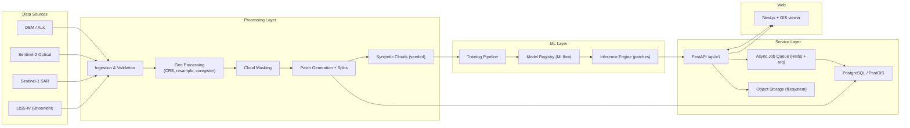
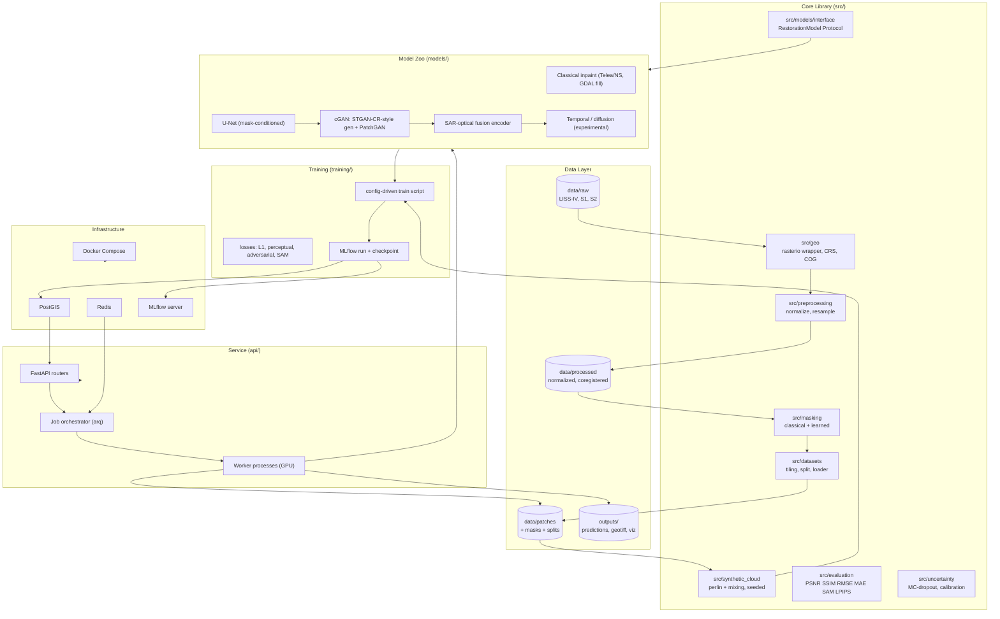
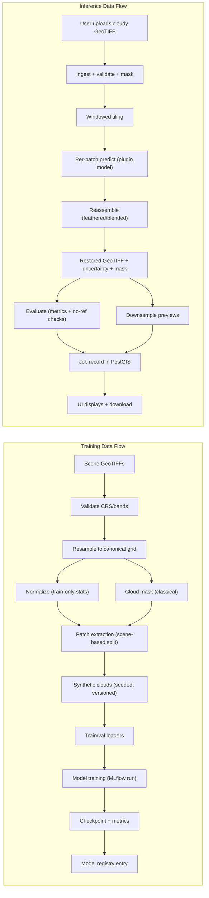
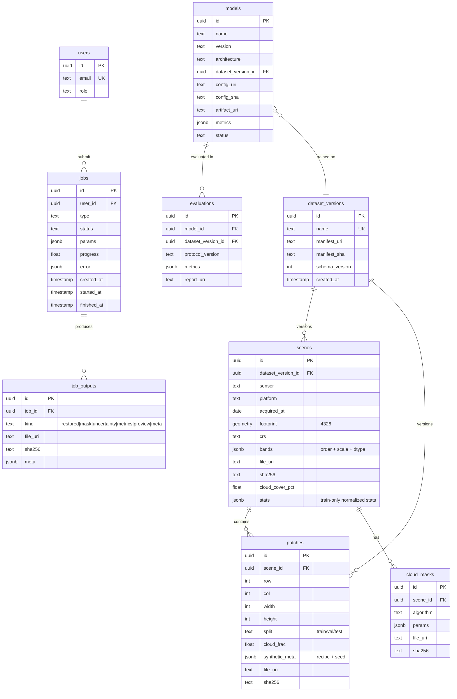
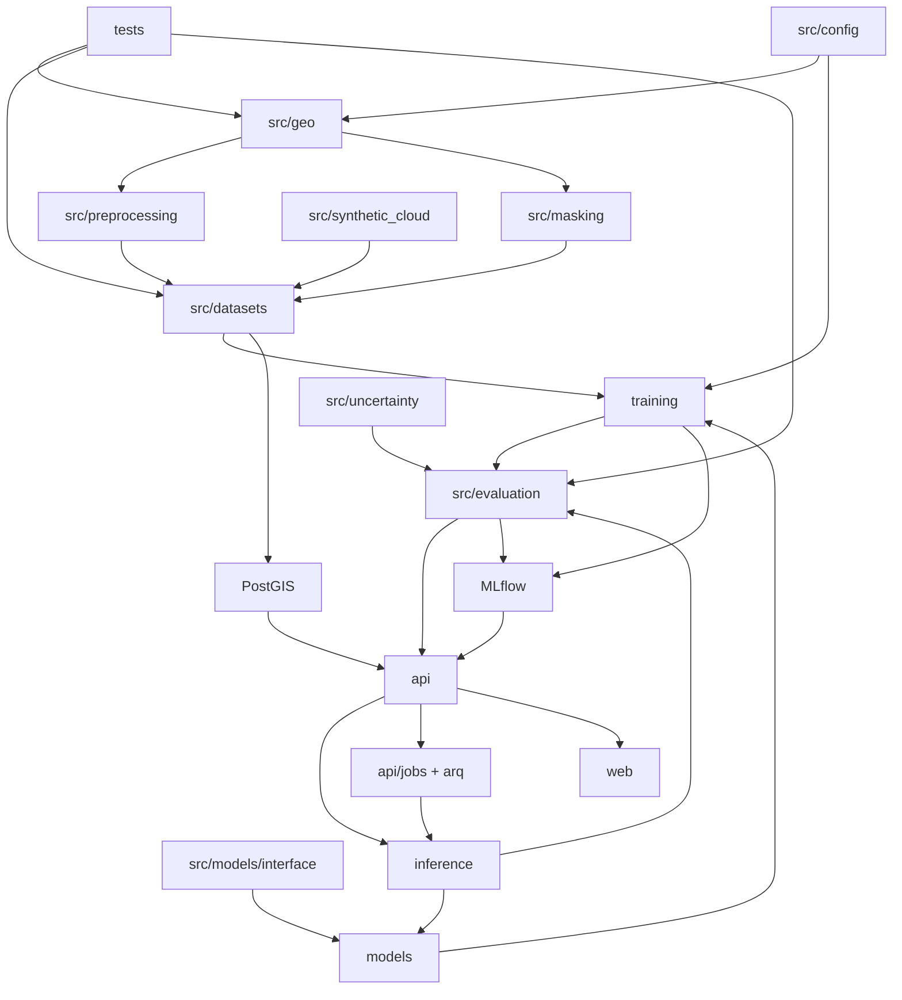

# GeoRestore AI — System Architecture & Implementation Plan

Status: approved as design reference (v1)
Scope: CloudClear-L4 flagship module + platform
Related: [[Overview]], [[Roadmap]], [[Architecture]], [[Evaluation_Protocol]]

---

## 0. Executive Summary

GeoRestore AI will be built as a **research-grade, production-oriented
platform**, not a notebook demo. The flagship module CloudClear-L4 performs
cloud removal and surface reconstruction for LISS-IV imagery, with a clear
model progression (classical baseline → U-Net → conditional GAN → SAR/optical
fusion → experimental diffusion), a rigorous, leakage-free evaluation
methodology, and an API + GIS web interface.

Key decisions at a glance:

1. **Patches are the unit of learning; scenes are the unit of integrity.**
   All splits, normalization, and versioning are anchored at scene level to
   prevent data leakage.
2. **Two evaluation tracks.** (a) Paired synthetic-cloud benchmark (known
   ground truth, mask-aware metrics, stratified by cloud severity). (b)
   Real-cloud restoration (no ground truth: no-reference + spectral/spatial
   checks + downstream validation + uncertainty).
3. **Generated pixels are never treated as ground truth.** Outputs always
   carry cloud mask + uncertainty + explicit observed/reconstructed pixel
   labeling.
4. **Models are plugins** behind one `RestorationModel` interface; adding a
   model never touches the pipeline.
5. **Reproducibility via versioning**: dataset manifests, config hashes,
   seeds, model registry — every artifact links to its exact inputs.
6. **Progression over ambition**: no diffusion, no Kubernetes, no vector DB,
   no multi-tenant auth in the initial phases.

---

## 1. Mission & Research Question

### Mission

Build GeoRestore AI as a modular, research-grade and production-oriented
platform for satellite image restoration and Earth observation, with
CloudClear-L4 (LISS-IV cloud removal) as the flagship module.

### Core Research Question

> How effectively can generative and multimodal models reconstruct
> cloud-obscured high-resolution LISS-IV imagery while preserving spatial
> structure, spectral fidelity, temporal consistency, and downstream
> geospatial utility?

This decomposes into measurable sub-questions:

- Q1 (reconstruction): How close to reference is the reconstruction inside
  cloud regions, per band, per cloud severity?
- Q2 (spectral fidelity): Are band-wise statistics and spectral angles
  preserved?
- Q3 (utility): Does restoration improve or degrade downstream land-cover
  segmentation / classification vs. the cloudy input?
- Q4 (multimodality): How much does Sentinel-1 SAR / temporal imagery add
  over optical-only restoration?
- Q5 (trust): How well do uncertainty estimates predict actual errors?

### Ground Rules (no false claims)

- No "state-of-the-art" claim is made until a comparable, controlled
  evaluation exists.
- Baseline numbers on synthetic clouds ≠ real-world performance; both must
  be reported separately.
- Every published number must cite dataset version + config hash + seed.

---

## 2. Design Principles & Prioritization

Priority order (per project instructions):

```
correctness > reproducibility > scientific validity > maintainability > scalability > visual polish
```

Consequences:

1. **Correctness**: CRS/geotransform validation on every I/O; band order and
   scaling preserved; no silent resampling; masks are uint8 with provenance.
2. **Reproducibility**: every run pinned by (config hash, dataset version,
   seed, model version, code commit). Metrics stored with CI/bootstraps.
3. **Scientific validity**: leakage-free splits; mask-aware metrics;
   stratified evaluation; statistical rigor (per-scene aggregation, paired
   tests); both synthetic and real tracks.
4. **Maintainability**: small typed modules; plugin model interface; configs
   in YAML; tests on geo correctness.
5. **Scalability**: async job queue, windowed raster I/O, patch parallelism —
   designed in, optimized later.
6. **Visual polish**: last; preview quality only after pipelines are correct.

---

## 3. Component Classification

Legend: R = Research, E = Engineering, O = Optional, H = High-risk, I = Independently implementable.

| Component | Class | Notes |
|---|---|---|
| LISS-IV ingestion + metadata | E / I | |
| Sentinel-1/2 ingestion | E / O / I | licensing + coregistration effort |
| CRS/reprojection/resampling | E / I | correctness-critical |
| Cloud masking (classical) | R / E / I | baseline masker; learned masker later |
| Synthetic cloud generation | R | must be seeded + versioned |
| Patch generation + splits | E / R | leakage-critical |
| Dataset versioning (manifests) | E / I | |
| Classical baselines (inpainting) | R / I | quick wins |
| U-Net baseline | R / E | MC-dropout uncertainty |
| Conditional GAN (main) | R / H | |
| SAR+optical fusion | R / H / O | coregistration is the hard part |
| Temporal restoration | R / H / O | |
| Diffusion/flow model | R / H / O | experimental, deferred |
| Uncertainty/calibration | R / H | |
| Evaluation library | R / E / I | mask-aware + CI |
| Downstream validation | R / O | segmentation/classification |
| FastAPI + jobs + workers | E / I | |
| PostGIS schema | E / I | |
| MLflow tracking | E / I | |
| Next.js GIS frontend | E / O | v2 polish |
| Auth/security | E / O | |
| Docker/CI/CD | E / O | |
| Change detection endpoint | R / O / H | defer |

---

## 4. A. High-Level System Architecture



---

## 5. B. Detailed Component Architecture



---

## 6. C. Data Flow Diagram

End-to-end flows for training and inference.



---

## 7. D. ML Training Pipeline

### 7.1 Principle

Training is **configuration-driven**: one YAML file per experiment resolves
fully (dataset version, split manifest, model, loss weights, optimizer,
seed, eval protocol) into a hash that names the run. No experiment is run
without a config hash.

### 7.2 Stages

1. **Data stage**: dataset version → patches + masks (synthetic and/or real)
   → loaders with fixed augmentation (rotation/ flip / scale safe for RS;
   albumentations with explicit mask handling; no elastic distortion that
   breaks geospatial correspondence).
2. **Model stage**: build from registry (`models/`), weights init recorded.
3. **Loss stage**: composite loss from registered components with weights
   from config:
   - `L_rec`: masked L1 / L2 (mask-weighted; cloud regions weighted higher)
   - `L_perc`: perceptual (LPIPS or VGG)
   - `L_adv`: adversarial (PatchGAN / hinge)
   - `L_spec`: spectral angle loss (SAM-based) across bands
   - `L_edge`: optional structure loss (gradient)
4. **Train loop**: deterministic seeding; AMP optional; gradient clipping;
   EMA optional; checkpoint per best val metric (recorded: best-by-PSNR,
   best-by-SAM separately).
5. **Validation**: mask-aware metrics on val scenes (never used for model
   selection beyond val; test only once per dataset version).
6. **Logging**: MLflow run = params (config hash), metrics (per epoch, per
   band), artifacts (checkpoint, config, val visualizations).
7. **Registration**: on finish, model + config + dataset version + metrics →
   model registry.

### 7.3 Determinism & Reproducibility

- Seed all RNG (torch, numpy, python, albumentations, synthetic clouds).
- Record: GPU model/driver, CUDA version, library versions (lock file),
  config hash, dataset version id, code commit.
- Prefer CPU-deterministic where feasible; if CUDA nondeterminism is found,
  document it rather than silently accept.

---

## 8. E. Inference Pipeline

For a single large GeoTIFF (the production path):

1. **Ingest**: rasterio open, validate CRS/geotransform/band count; read
   metadata; compute scene-level stats; detect nodata.
2. **Mask**: cloud mask (selected algorithm) at scene or patch level;
   store confidence variant too.
3. **Tile**: overlapping windows aligned to the training patch grid;
   overlap ~25%; pad edges with reflect.
4. **Predict**: per patch through plugin model (GPU batch); collect values +
   uncertainty.
5. **Reassemble**: weighted blend in overlap zones (distance-based or
   uncertainty-weighted); guarantees pixel-grid alignment with input.
6. **Postprocess**: inverse normalization; clip to valid range; preserve
   observed pixels outside mask exactly (identity for clear pixels by
   default — configurable "restore-all" mode for experimentation).
7. **Write outputs**: COG GeoTIFF (restored), mask GeoTIFF, uncertainty
   GeoTIFF, observation-status layer (observed/reconstructed/uncertain),
   processing metadata JSON (model, config hash, timings, software
   versions).
8. **Evaluate**: paired metrics if reference available; otherwise
   no-reference suite.
9. **Previews**: downsampled PNG/WebP tiles for the UI.

Small-patch sync path (debug): same code path, no tiling.

---

## 9. F. Dataset Architecture

### 9.1 Layout

```
data/
  raw/            # immutable source files (never modified)
  processed/      # normalized, resampled, coregistered per dataset version
  patches/        # tiles + masks + split manifests
  benchmarks/     # synthetic benchmark manifests
  metadata/       # manifests (JSON), stats, logs
```

### 9.2 Versioning

- **Dataset version** = folder + `manifest.json` containing: schema version,
  file list with SHA-256, CRS, band order + scaling, acquisition dates,
  normalization stats (train-only), split assignment, cloud-mask algorithm
  + params, synthetic-cloud algorithm + seed, preprocessing commands.
- Manifests are the single source of truth; a dataset version is immutable
  once created (append-only).
- Any change (e.g., new masker, new normalization) → new version, not edits.

### 9.3 Sources

| Source | Use | Notes |
|---|---|---|
| LISS-IV (Bhoonidhi) | primary optical | ~5.8 m, G/R/NIR, needs license handling |
| Sentinel-2 | auxiliary optical | cloud-free references, cross-scale study |
| Sentinel-1 | SAR auxiliary | all-weather structure info, coregistration needed |
| DEM (SRTM/ALOS) | optional auxiliary | slope/aspect channels |
| Temporal stack | optional | same-scene cloud-free dates |

### 9.4 Patch convention

- Patch size: 256×256 (default), stride configurable; training on 128 or 512
  via config.
- Bands: `[G, R, NIR, cloud_mask]` for optical baseline; SAR fusion adds
  `[VV, VH, ratio]`; temporal adds stacked dates.
- Patches with >95% cloud or >95% nodata are dropped (recorded).
- Every patch carries provenance: scene id, window coords, split, mask
  algorithm, synthetic recipe.

### 9.5 Synthetic cloud generation (controlled supervised training)

Three techniques, all seeded and versioned:

1. **FBM/PF fractal clouds** — Perlin/FBM noise → opacity + transmittance
   (physics-informed attenuation for thin clouds); thick clouds zero out the
   signal.
2. **Cloud mixing (real clouds)** — extract cloud layers from real cloudy
   scenes (e.g., LISS-IV or Sentinel-2 cloud scenes) and composite onto
   clear scenes with blending (transfer learning between scenes).
3. **Controlled recipes** — severity labels (thin/moderate/thick), cloud
   fraction bins (0-10%, 10-30%, 30-60%, 60-100%), optional shadow synthesis.

Used for: training (paired GT), benchmark (mask-aware metrics), severity
experiments. Real-cloud evaluation never uses synthetic GT.

---

## 10. G. Model Architecture Options

All models implement the plugin interface:

```python
class Prediction:
    values: np.ndarray      # (C, H, W) float32
    uncertainty: np.ndarray # (H, W) float32
    meta: dict              # model, version, config hash, timings

class RestorationModel(Protocol):
    name: str
    input_modality: str     # "optical" | "sar_optical" | "temporal"
    def predict(self, patch: np.ndarray, cloud_mask: np.ndarray,
                context: dict) -> Prediction: ...
```

Registry entries are config-resolved; the pipeline never imports model
classes directly.

### Progression (implement in order)

| ID | Model | Input | Loss | Notes |
|---|---|---|---|---|
| M0 | Classical inpainting (Telea/NS, GDAL fill, harmonic temporal) | cloudy + mask | n/a | baseline only; no uncertainty |
| M1 | U-Net (ResNet-18/34 encoder, 4-5 levels, mask-channel input) | G,R,NIR + mask | masked L1 + SSIM | MC-dropout uncertainty; fast |
| M2 | Conditional GAN: STGAN-CR-style generator (transformer/attention GAN) + PatchGAN | G,R,NIR + mask | L1 + LPIPS + adv + SAM-loss | main research model |
| M3 | SAR-optical fusion: two encoders + cross-attention fusion | + VV,VH | same as M2 | needs coregistration; despeckle |
| M4 | Temporal: multi-date stack encoder | + past/future clear dates | same | needs temporal corpus |
| M5 | Diffusion / flow (experimental) | any | DDPM / rectified-flow | deferred; keep as experiment |

### 10.1 Key modeling decisions

- **Mask conditioning** everywhere: mask as input channel AND as loss weight
  map. Do not let the model silently change clear pixels (unless explicitly
  studying that).
- **Identity path**: by default clear pixels are preserved in the output;
  only masked regions are replaced. This is a product decision with
  scientific consequences (metrics must be mask-aware anyway).
- **Multi-band**: operate on all bands jointly; never per-band RGB collapse
  in metrics (NIR drives NDVI; per-band reporting mandatory).
- **Normalization**: per-band z-score from train-only stats; inverse on
  output; DN→reflectance scale recorded in manifest.
- **Uncertainty**: MC-dropout (M1/M2) + optionally a heteroscedastic head;
  calibrated against synthetic errors; used in uncertainty-aware blending.

---

## 11. H. API Architecture

### 11.1 Endpoints (v1)

```
GET  /api/v1/health
POST /api/v1/cloud-detect      # returns mask job
POST /api/v1/restore           # returns job_id
POST /api/v1/evaluate          # paired or no-reference eval
POST /api/v1/change-detect     # optional, deferred
GET  /api/v1/models            # registry listing
GET  /api/v1/jobs/{job_id}     # status + result URLs
GET  /api/v1/jobs/{job_id}/artifacts/{kind}   # download
```

### 11.2 Job pattern

- All heavy operations are async: `POST` returns `job_id` (201), client
  polls `GET /api/v1/jobs/{id}`.
- Job lifecycle: `queued → running → succeeded | failed | cancelled`; job
  row stores params, progress, error traceback (sanitized), artifact URIs.
- Redis + `arq` (async-native) as queue; worker pool (GPU workers for
  model inference, CPU workers for geo jobs).
- Small-patch debug endpoints (synchronous) optional for UI experimentation.

### 11.3 Conventions

- Versioned API (`/api/v1`); pydantic v2 schemas for request/response;
  OpenAPI auto-docs.
- Upload: multipart with size limits + type validation (GeoTIFF magic check,
  tiff header, GDAL-open check), path-traversal-safe storage.
- Artifacts served via authenticated download routes; no direct static
  exposure of `outputs/`.

---

## 12. I. Frontend Architecture

- **Stack**: Next.js (App Router) + TypeScript + MapLibre GL (GIS viewer).
- **Pages/views**:
  - Upload + metadata inspection (raster info, CRS, bands, stats)
  - Scene view: original / cloud mask / restored / uncertainty / diff layers
  - Model selection (from `/models`)
  - Run restore → poll job → result panels
  - Metrics table (PSNR/SSIM/RMSE/MAE/SAM per band + mask-aware) + charts
  - History: processing jobs + model versions + dataset versions
  - Download GeoTIFFs (restored, mask, uncertainty)
- **Raster display**: server-generated previews (COG overviews or
  downsampled WebP tiles); no heavy client-side raster processing in v1.
  Full slippy-tile pipeline deferred to Production phase.
- **State**: TanStack Query for job polling; zustand for app state.
- PWA/offline, auth screens deferred.

---

## 13. J. Database / PostGIS Schema



Notes:

- All geo data PostGIS geometry; footprints in EPSG:4326, rasters in native
  CRS (recorded).
- `patches.split` is denormalized for fast sampling; the manifest is the
  authority (job re-derives from manifest, not from DB, for reproducibility).
- Indexes: scenes(footprint) GIST, patches(scene_id, split), jobs(status,
  created_at), models(name, version).

---

## 14. K. Storage Architecture

| Tier | Location | Contents |
|---|---|---|
| Raw | `data/raw/` | immutable source rasters (LISS-IV, S1, S2, DEM) |
| Processed | `data/processed/` | normalized/coregistered per dataset version |
| Patches | `data/patches/` | tiles, masks, manifests |
| Models | `models/` + MLflow artifacts | checkpoints (never in vault) |
| Outputs | `outputs/` | predictions, geotiff, visualizations |
| Vault | `knowledge/` | markdown only (no data/binaries) |
| DB | PostGIS | metadata, jobs, versions |
| Cache | Redis | queue + optional preview cache |

Rules:

- GeoTIFFs written as **COG** (tiled, overviews, DEFLATE/ZSTD, BIGTIFF when
  needed) for streaming and partial reads.
- Files > ~4 GB flagged; chunked writes; no in-memory full-raster ops.
- SHA-256 checksums recorded in manifests and DB for integrity.
- No large binaries in `knowledge/` (AGENTS.md rule); no raw data in git.

---

## 15. L. Experiment Tracking Architecture

Two synchronized layers:

1. **MLflow** (machine-readable): runs with params (config hash), metrics
   (per-epoch, per-band, mask-aware), artifacts (checkpoint, config, plots),
   registered models.
2. **Knowledge vault** (human-readable): `knowledge/05_Experiments/
   Experiment_NNN.md` per AGENTS.md template, containing the run IDs,
   config hash, dataset version, results, interpretation.

Linking rule: every Experiment_NNN.md cites `mlflow_run_id`, `config_sha`,
`dataset_version`, `model_version`, `seed`. Every MLflow run stores the same
four keys as tags. The experiment matrix (section U) is the index.

Tracking server: MLflow server container + Postgres backend + artifact
filesystem; UI on LAN.

---

## 16. M. Deployment Architecture

### M.1 Dev (Phase 1–2)

Docker Compose: `api` (FastAPI + uvicorn), `worker` (arq, GPU passthrough),
`redis`, `postgis`, `mlflow`, `web` (Next.js), optional `nginx`.

### M.2 Research box (Phase 3)

Single GPU host + the same compose stack; training CLI runs on host (or in
a `trainer` container) writing to MLflow.

### M.3 Production (Phase 4, minimal)

- API workers ×N, GPU inference workers ×N behind nginx.
- PostGIS + Redis managed or containers with backups.
- Model registry as the only source for model artifacts (deploy by version).
- Logging/metrics: structured JSON logs + Prometheus/Grafana (optional).
- No Kubernetes in initial phases.

---

## 17. N. Security Considerations

1. **Upload validation**: extension + TIFF magic bytes + GDAL-open probe;
   size limits; file type allowlist; no execution of uploaded content.
2. **Path safety**: sanitize filenames; artifact paths derived from DB ids,
   never user input; no symlink escapes.
3. **Model artifacts**: load only from registry paths; JSON/pickle-free
   metadata; checkpoints from trusted sources only (reproducibility vs
   model-injection risk).
4. **API**: rate limiting; API keys (v1), JWT/OIDC (v2, optional); CORS
   locked to web origin; job ownership checks.
5. **Secrets**: env-based, never in git; `.env.example` only.
6. **DB**: internal network only; least-privilege PostGIS role; no direct
   exposure.
7. **Dependencies**: pinned lockfile; `pip-audit`/`trivy` in CI.
8. **Scientific integrity** (security-adjacent): immutable dataset versions
   (append-only), checksums, audit trail of jobs — prevents silent
   retroactive changes that corrupt results.

---

## 18. O. Scalability Considerations

- **Patch parallelism**: raster jobs split into independent window tasks →
  worker pool; horizontal scaling by adding workers.
- **Windowed I/O**: rasterio windows end-to-end; never materialize full
  rasters; COG overviews for previews.
- **Queue**: Redis + arq; backpressure via queue length; job timeouts and
  retries with idempotent re-runs (job id in params).
- **GPU sharing**: one GPU, batched patch inference, model pinned in worker;
  multiple workers only on multi-GPU hosts.
- **Caching**: preview cache in Redis/LRU; optional tile cache in
  Production.
- **Dataset scale**: manifests allow incremental downloads; raw data can
  live off-box (NFS/object store) in Production.
- Explicitly NOT designed in v1: distributed training, K8s autoscaling,
  multi-region.

---

## 19. P. Failure Modes & Scientific Risks

| # | Risk | Severity | Mitigation |
|---|---|---|---|
| P1 | Cloud mask errors propagate into output and metrics | High | mask quality eval; mask algorithm + params versioned; uncertainty layer; allow manual mask override in UI |
| P2 | No cloud-free LISS-IV ground truth for real validation | High | dual-track eval (synthetic paired + real no-reference); temporal references; downstream checks |
| P3 | SAR↔optical coregistration misalignment ruins fusion | High | AROSICS-style coregistration; residual-shift tolerance tests; quality gates before training M3 |
| P4 | Model overfits synthetic clouds (fails on real clouds) | High | real-cloud holdout always; domain gap experiments (U16); cloud-mixing real recipes |
| P5 | Radiometric inconsistency between scenes/periods | Medium | normalization per version with train-only stats; record scaling; per-scene stats in outputs |
| P6 | OOM on large rasters | Medium | windowed ops everywhere; memory budgets in workers; BIGTIFF |
| P7 | Training instability (GAN collapse / divergence) | Medium | controlled training protocol; diagnostic logs; EMA; restart from checkpoints |
| P8 | Metric gaming (models that blur → high PSNR) | Medium | report SSIM/SAM/LPIPS jointly; mask-aware; downstream tests; visual QC samples |
| P9 | Spectral drift in reconstructed bands | Medium | SAM loss + band-wise metrics + spectral stats checks |
| P10 | Temporal mismatch (dates far apart → land change confounds GT) | Medium | date-window constraints for temporal training pairs; document change risk |
| P11 | Dependency rot / broken reproducibility later | Medium | lockfiles, manifest sha, containerized runs |
| P12 | UI shows unvalidated reconstructions as "true" | Medium | observation-status layer; uncertainty display; disclaimer |

---

## 20. Q. Model Hallucination Risks

Reconstruction is generation, not measurement. Specific risks:

1. **Structural hallucination** — plausible-but-wrong land cover in masked
   regions (e.g., fabricating a road or water body). Mitigation: uncertainty
   maps; spatial-consistency checks; downstream-task degradation analysis;
   conservative reporting.
2. **Spectral hallucination** — invented spectra outside the data manifold
   (breaks vegetation indices). Mitigation: SAM loss, spectral statistics
   checks, band-wise metrics, spectral consistency eval.
3. **Over-smoothing vs over-sharpening** — GANs can produce high-frequency
   artifacts; U-Nets blur. Mitigation: joint metric reporting; visual QC
   set; LPIPS.
4. **Confidence illusion** — model's confidence ≠ correctness. Mitigation:
   calibrated uncertainty (MC-dropout + reliability analysis); uncertainty
   never removed from outputs.
5. **Distribution shift** — model trained on one season/region fails
   elsewhere. Mitigation: spatially held-out test sets (AllClear-style);
   geographic stratification in experiments.

Policy: every delivered image is accompanied by mask + uncertainty +
status layer; UI labels reconstructed pixels as model-generated.

---

## 21. R. Data Leakage Risks

| # | Leak path | Control |
|---|---|---|
| R1 | Same scene in train and test (patch-level random split) | **Scene-level split only**; patches inherit scene split |
| R2 | Nearby scenes spatially overlap across splits | buffer zones; split by spatial clustering of scene footprints (≥1 tile margin); check in CI |
| R3 | Normalization stats computed on all data | stats from train split only, frozen per version |
| R4 | Masker tuned/evaluated on test scenes | masker params chosen on val; frozen per version |
| R5 | Temporal overlap (same area, later dates in train, earlier in test) | split by area not date when temporal data is used; document |
| R6 | Synthetic cloud generator state reused across splits | per-version seed; different regions for val/test synthetic recipes |
| R7 | Model selection on test | test evaluated once per dataset version; strict protocol |
| R8 | Augmentation seeded by global RNG nondeterminism | per-sample seed tracking in loaders |
| R9 | Reported metrics averaged over correlated patches | per-scene aggregation + bootstrap CI |

---

## 22. S. Train/Validation/Test Split Strategy

1. **Unit**: scene (image), never patch.
2. **Ratio**: 70/15/15 scene-level.
3. **Spatial hygiene**: scene footprints must not overlap; if scenes are
   adjacent/overlapping, assign the overlapping region wholly to the train
   side or apply a ≥1 tile buffer; automated check in the split tool.
4. **Stratification**: balance by region/season when known; keep a
   geographically held-out subset (e.g., one district) for generalization
   experiments.
5. **Immutability**: split assignment written into the dataset manifest at
   version creation; changing a split → new dataset version.
6. **Test usage policy**: test set is only touched at the end of an
   experiment cycle; val used for selection.
7. **Real-cloud holdout**: a separate set of scenes with real clouds is
   never used for training; used for the real track evaluation.

---

## 23. T. Evaluation Methodology

### 23.1 Paired track (synthetic clouds / temporal GT)

- Metrics: PSNR, SSIM, RMSE, MAE, SAM, LPIPS (optional), per band AND mean.
- **Mask-aware**: metrics computed separately on (a) clear regions, (b)
  cloud regions, (c) cloud-boundary band (erosion/dilation band of ~8 px).
  Cloud-region metrics are the headline numbers.
- **Stratified**: by cloud fraction bin and by severity class
  (thin/moderate/thick).
- **Statistical rigor**: aggregate per scene (not per patch); report mean ±
  bootstrap 95% CI; paired tests (Wilcoxon) between models.
- **Spectral checks**: band-wise mean/std of reconstruction vs reference;
  spectral angle distributions; NDVI preservation stats.

### 23.2 Unpaired track (real clouds, no GT)

- No-reference: band histogram distance, local gradient coherence across
  mask boundary, spectral angle on clear pixels, texture statistics.
- Consistency: reconstructed region vs adjacent clear context continuity.
- Uncertainty calibration: error (from synthetic pairs) vs predicted
  uncertainty correlation; reliability diagrams.
- Downstream utility: run fixed downstream model on cloudy input vs
  restored output vs (if available) clear reference; report change in
  accuracy — never claim improvement without this test.
- Expert visual QC set: fixed 20-50 samples reviewed per release.

### 23.3 Evaluation protocol versioning

Protocol version increments with any metric/decision change; stored in
`evaluations.protocol_version`; results only comparable within a protocol
version.

---

## 24. U. Research Experiment Matrix

All experiments land in `knowledge/05_Experiments/Experiment_NNN.md` with
the AGENTS.md template.

| ID | Experiment | Question | Models | Track |
|---|---|---|---|---|
| E001 | Baseline sweep | Classical vs U-Net floor | M0, M1 | paired |
| E002 | cGAN vs U-Net | Does adversarial training help LISS-IV? | M1, M2 | paired |
| E003 | Loss ablation | Contribution of perceptual/SAM/adversarial | M2 variants | paired |
| E004 | Cloud severity sweep | Performance vs thin/moderate/thick | M1, M2 | paired+stratified |
| E005 | Cloud fraction sweep | Performance vs 0-10/10-30/30-60/60-100% | M1, M2 | paired+stratified |
| E006 | SAR fusion ablation | Value of VV/VH vs optical-only | M2, M3 | paired |
| E007 | Temporal ablation | Value of temporal clear frames | M2, M4 | paired |
| E008 | Diffusion experiment | Feasibility + quality vs cGAN | M5 | paired (experimental) |
| E009 | Uncertainty calibration | MC-dropout calibration vs errors | M1, M2 | paired |
| E010 | Downstream utility | Segmentation before/after restoration | M2 best | downstream |
| E011 | Real-cloud validation | Real LISS-IV clouds, no-reference suite | M1, M2, M3 | unpaired |
| E012 | Spectral fidelity study | Band-wise + NDVI preservation | M1, M2 | paired |
| E013 | Geographic generalization | Held-out region/season | M2 | paired+unpaired |
| E014 | Dataset version delta | Effect of dataset improvements | M2 | paired |
| E015 | Mask sensitivity | Effect of mask errors on output | M2 | paired |
| E016 | Synthetic→real domain gap | Gap quantification | M2, M3 | mixed |

Selection rule: E001–E005 are the core scientific path; E006/E007/E010 are
the multimodal claims; E009 is trust; E008 and E016 are exploratory.

---

## 25. V. Phased Implementation Roadmap

### Phase 0 — Foundations (≈2 weeks)

Scope: repo skeleton, config system, geo I/O correctness, dataset tooling,
versioning, CI quality gates.

### Phase 1 — MVP Baseline (≈3–4 weeks)

Scope: ingestion + preprocessing + cloud masking + synthetic clouds +
patches/splits; M0 classical baseline + M1 U-Net; training loop; eval
library; minimal FastAPI + async jobs + basic web upload/view; first
Experiment (E001).

### Phase 2 — Research Prototype (≈6–8 weeks)

Scope: M2 conditional GAN (main model); full experiment harness
(E001–E005); MLflow deep integration; uncertainty + calibration (E009);
downstream validation (E010); GeoTIFF outputs + metadata complete;
Experiment_NNN notes for every run.

### Phase 3 — Multimodal System (≈8–12 weeks)

Scope: Sentinel-1/2 ingestion + coregistration; M3 SAR-optical fusion
(E006); temporal stack + M4 (E007); diffusion experiment M5 (E008, optional
stop); change-detect endpoint (optional); geographic generalization (E013).

### Phase 4 — Production Platform (≈4–6 weeks)

Scope: auth, rate limiting, COG tile serving, map viewer polish, monitoring
(logs/metrics), backup/restore, deployment runbook, load testing, security
review, release checklist.

Timeline is indicative; gates are DoD-based (section Z).

---

## 26. W. Repository Structure

```
GeoRestore/
├── AGENTS.md
├── README.md
├── ARCHITECTURE.md            # this plan (standalone copy)
├── pyproject.toml
├── docker-compose.yml
├── configs/                   # YAML: dataset, model, train, eval, api
│   ├── dataset/*.yaml
│   ├── model/*.yaml
│   ├── train/*.yaml
│   └── eval/*.yaml
├── src/
│   ├── geo/                   # rasterio wrapper, CRS, COG, windows
│   ├── preprocessing/         # normalize, resample, stats
│   ├── masking/               # classical + learned cloud masks
│   ├── synthetic_cloud/       # seeded generators
│   ├── datasets/              # tiling, splits, loaders, manifests
│   ├── evaluation/            # metrics, mask-aware, bootstrap
│   ├── uncertainty/           # MC-dropout, calibration
│   ├── models/                # RestorationModel interface + registry
│   ├── config.py              # pydantic-settings config loader
│   └── utils/                 # logging, hashing, seeds
├── models/                    # concrete architectures
│   ├── classical/  unet/  cgan/  fusion/  temporal/  diffusion/
├── training/                  # train.py, losses.py, callbacks.py
├── inference/                 # tiling, reassembly, geotiff writer
├── preprocessing/             # CLI scripts for data pipelines
├── evaluation/                # CLI: benchmark runner, report gen
├── api/                       # FastAPI app, routers, schemas
├── web/                       # Next.js app
├── tests/                     # unit + geo correctness + leakage checks
├── data/                      # raw/ processed/ patches/ benchmarks/
├── outputs/                   # predictions/ geotiff/ visualizations/
├── knowledge/                 # Obsidian vault
└── infra/                     # docker, nginx, backup scripts
```

---

## 27. X. Technology Choices & Justification

| Choice | Why | Alternative rejected |
|---|---|---|
| Python 3.11+ | RS/ML ecosystem standard | |
| PyTorch 2.x | research flexibility, cuda graphs, torch.compile | TF (rigid) |
| rasterio + GDAL | authoritative GeoTIFF/COG/CRS handling | tifffile alone (no CRS) |
| numpy / OpenCV / scikit-image | core arrays, morphology, inpainting baselines | |
| albumentations | RS-safe augmentation with mask sync | torchvision (no mask support) |
| torchgeo (optional) | sensor-agnostic RS loaders | not required at start |
| FastAPI + uvicorn + pydantic v2 | typed API, async, OpenAPI | Flask (sync) |
| Redis + arq | async-native job queue, minimal moving parts | Celery (heavier) |
| PostgreSQL + PostGIS | geospatial metadata + queries | sqlite (no geo) |
| MLflow | config-hash linked runs + registry | W&B (SaaS), custom (effort) |
| Next.js + TS + MapLibre GL | robust GIS-ish UI, active ecosystem | plain React + Leaflet |
| Docker Compose | single-host dev + research box | K8s (premature) |
| pytest + ruff + mypy | correctness gates | |
| Mermaid-in-MD | diagrams live with knowledge | external drawio |

---

## 28. Y. What Should NOT Be Implemented Initially

1. RAG / vector DB / embeddings for the vault (filesystem + wikilinks is
   enough; AGENTS.md rule).
2. Diffusion/flow model (M5) — after cGAN and fusion are proven.
3. Kubernetes, Helm, KServe/TorchServe.
4. Multi-tenant auth / OIDC / SSO.
5. Full slippy-tile serving + COG streaming (Phase 4, minimal).
6. DVC or heavy pipeline orchestrators (Airflow/Prefect) — manifests +
   scripts suffice at this scale.
7. Distributed training (DeepSpeed etc.).
8. Change detection endpoint (defer to Phase 3 optional).
9. LPIPS as a required metric (optional module only).
10. Anything requiring "SOTA" benchmark racing.
11. Model compression/distillation, quantization.
12. Mobile/offline apps, real-time streaming.

---

## 29. Z. Definition of Done

| Phase | DoD (all must hold) |
|---|---|
| 0 | pyproject lock; ruff+mypy+pytest green; config loader + hash; geo I/O round-trip tests (CRS/geotransform preserved); manifest tool; CI on git push |
| 1 | 20+ LISS-IV scenes ingested + versioned; cloud masks generated; ≥5k train patches (synthetic + real); M0 + M1 train end-to-end; eval lib (PSNR/SSIM/RMSE/MAE/SAM, mask-aware) with tests; API: upload, cloud-detect, restore, jobs, models; async worker runs a restore end-to-end producing GeoTIFF + mask + metadata; web: upload → view → download; E001 documented |
| 2 | M2 cGAN trained + registered; E001–E005 run with config hashes + seeds; MLflow UI usable; uncertainty + calibration report; downstream segmentation eval (E010); outputs include uncertainty + status layers; Experiment notes updated per template |
| 3 | S1/S2 ingestion + coregistration pipeline with quality gates; M3 fusion model beats optical-only on cloud-region metrics (or documented negative result); E006/E007 documented; M5 experiment documented even if negative; generalization study (E013) |
| 4 | Auth + rate limiting; monitoring + logs; backup/restore tested; load test ≥10 concurrent jobs; security review checklist passed; deployment runbook; release notes; final architecture review |

---

## 30. Module Dependency Graph



Independent subgraphs (buildable in parallel):

- Data stack: CONFIG → GEO → PREP → MASKS → SYN → PATCH
- Model stack: IFACE → MODELS → TRAIN
- Evaluation stack: EVAL + UNC (depends on data types only)
- Service stack: API + JOBS + WEB (depends on interfaces, not internals)

---

## 31. First 20 Implementation Tasks (ordered by dependency)

| # | Task | Depends on | Est. |
|---|---|---|---|
| 1 | Repo skeleton: pyproject, ruff/mypy/pytest, CI, .env.example | — | 0.5 d |
| 2 | Config system: pydantic-settings + YAML loader + config hash | 1 | 1 d |
| 3 | `src/geo`: rasterio wrapper (open/validate CRS+geotransform+bands, COG write) + tests | 2 | 2 d |
| 4 | LISS-IV ingestion CLI (Bhoonidhi → `data/raw` + sidecar metadata) | 3 | 2 d |
| 5 | Dataset manifest tool (sha256, schema version, stats, immutable) | 4 | 2 d |
| 6 | Preprocessing: resample/normalize (train-only stats), band order checks | 3, 5 | 2 d |
| 7 | Cloud masking v1 (threshold-based + morphological cleanup) + mask quality eval hook | 6 | 2 d |
| 8 | Patch extraction: grid tiling + overlap + provenance | 6, 7 | 2 d |
| 9 | Scene-based split tool + leakage checks (footprint overlap, buffer) | 8 | 1.5 d |
| 10 | Synthetic cloud module v1 (FBM + mixing, seeded, severity labels) | 8 | 3 d |
| 11 | Dataset v001 build: 20 scenes → patches + masks + manifest + split | 5–10 | 3 d |
| 12 | M1 U-Net (mask-conditioned) + config | 2 | 2 d |
| 13 | M0 classical baselines (Telea/NS + GDAL fill wrapper) | 3 | 1 d |
| 14 | Training loop v1 (seeded, checkpointing, val, logging) | 2, 12 | 3 d |
| 15 | Evaluation lib: PSNR/SSIM/RMSE/MAE/SAM per-band + mask-aware + bootstrap CI | 3 | 3 d |
| 16 | MLflow integration (run = config hash, dataset version, seed; registry) | 14, 15 | 2 d |
| 17 | API skeleton: health, models, jobs CRUD, upload (validation + size limits) | 2, 3 | 3 d |
| 18 | Async job runner (Redis + arq): restore pipeline as job | 16, 17 | 3 d |
| 19 | Inference engine: windowed tiling → predict → blend reassembly → GeoTIFF + mask + uncertainty + metadata | 12, 15, 18 | 4 d |
| 20 | Web v1: upload, model select, job poll, result view, metrics table, download | 17, 18, 19 | 5 d |

Notes: tasks 3–10 form the data stack (independent of 12–16 model stack);
after task 11 the data stack and model stack can proceed in parallel. Task 20
is the MVP milestone gate (Phase 1 DoD).

---

## 32. Landscape Notes & References

Research context (2024–2026):

- LISS-IV cloud removal is an active contest/application area (ISRO
  problem statements, hackathons); common pattern: cloud-detection stage
  (U-Net++/attention) + generative reconstruction stage (SPADE-GAN /
  diffusion) with SAR/S2 auxiliary data; optical only at 5.8 m.
- SAR-optical fusion is well established for Sentinel-2 (cGAN SAR-opt-GAN,
  Simulation-Fusion GAN, attention-based PolNet-CR, diffusion EDM-CR,
  DMDiff). Coregistration (AROSICS-style) is consistently the practical
  bottleneck.
- Benchmarks: SEN12MS-CR(-TS), AllClear. Their methodological norms:
  per-band metrics, stratified evaluation by cloud coverage, spatially
  held-out test sets, downstream-task validation, uncertainty (UnCRtainTS).
- Metrics standard: PSNR/SSIM/RMSE/MAE/SAM central; per-band SSIM
  mandatory (RGB-collapsed metrics hide NIR errors that drive NDVI).
- Performance degrades with cloud cover fraction and on water/snow
  classes; expected, must be stratified.

Key references to record in [[Literature_Review]]:

- Ebel et al., SEN12MS-CR / SEN12MS-CR-TS, IEEE TGRS 2020/2022.
- Meraner et al., Cloud removal in Sentinel-2 via deep residual network +
  SAR-optical fusion, ISPRS J. Photogramm. Remote Sens. 2020.
- Grohnfeldt et al., cGAN SAR+MS fusion, IGARSS 2018; Gao et al.
  Simulation-Fusion GAN, MDPI RS 2020.
- Ebel et al., UnCRtainTS (uncertainty), 2023.
- AllClear dataset & benchmark (arXiv 2410.23891).
- Czerkawski et al., SatelliteCloudGenerator, MDPI RS 2023.
- Cai et al., EDM-CR diffusion SAR+optical, RSE 2025.
- Xu et al., GLF-CR; RSIIPAC PolNet-CR 2023; DMDiff 2025.

---

## 33. Appendix — Open Questions to Resolve

1. Bhoonidhi access terms: license, download limits, level (L1/L2), DN
   scaling, cloud-free reference availability.
2. Ground-truth strategy: is there any labeled/cloud-free LISS-IV archive
   (temporal) to validate real restoration?
3. GPU availability for training (single card? VRAM size?) — affects
   patch size and batch.
4. Deployment target for Phase 4 (on-prem vs cloud) — affects storage and
   auth.
5. Whether "restore-all" mode (model touches clear pixels too) is ever
   needed scientifically (default: preserve clear pixels).

Resolve before Phase 1 completes; record answers in [[Requirements]] and
[[Dataset_Decisions]].
