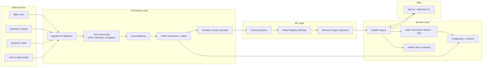
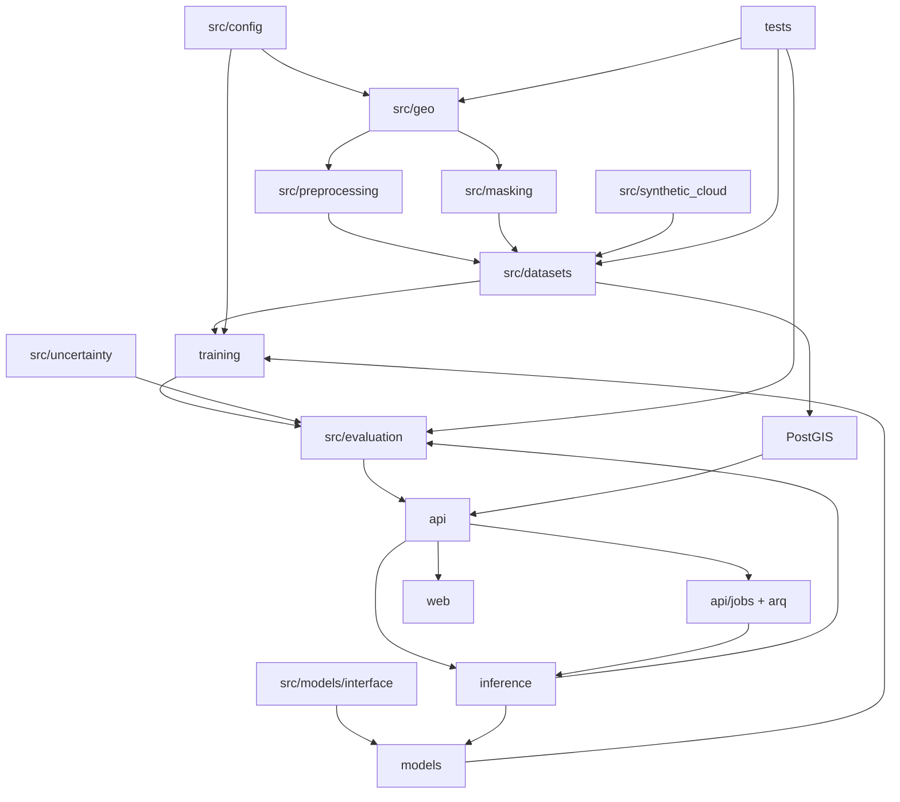

# System Architecture — GeoRestore AI

Status: approved blueprint component
Parent: [[Architecture_Plan]]

## 1. Architectural Style

Layered modular monolith + worker processes:

- **Core library** (`src/`) — pure Python, no server logic, fully testable.
- **Model zoo** (`models/`) — concrete architectures behind one plugin
  interface.
- **Service layer** (`api/`) — FastAPI + async job workers.
- **Web** (`web/`) — Next.js GIS frontend.
- **Infrastructure** — PostGIS, Redis, MLflow, Docker Compose, filesystem
  storage.

Units of processing: **patch** (learning) and **scene** (integrity).

## 2. High-Level Diagram



## 3. Component Inventory

| Module | Responsibility | Depends on | Owns |
|---|---|---|---|
| `src/geo` | rasterio wrapper: open, validate CRS/geotransform/bands, COG write, windowed reads | rasterio/GDAL | geo contracts |
| `src/preprocessing` | resample, normalize (train-only stats), band checks | src/geo | stats JSON |
| `src/masking` | cloud masks v1 (classical) + learned later | src/geo | mask params |
| `src/synthetic_cloud` | seeded FBM + cloud-mixing generators | numpy | recipes |
| `src/datasets` | tiling, scene splits, loaders, manifests | src/geo | manifests |
| `src/evaluation` | metrics, mask-aware, bootstrap CI, reports | numpy/skimage | protocol version |
| `src/uncertainty` | MC-dropout, calibration | torch | calibration reports |
| `src/models/interface` | `RestorationModel` Protocol + registry | — | plugin contract |
| `models/` | M0–M5 concrete architectures | interface | weights |
| `training/` | train loop, losses, callbacks, config loading | src/* | checkpoints |
| `inference/` | windowed tiling, predict, blend, GeoTIFF writer | src/* | output rasters |
| `api/` | FastAPI routers, schemas, job orchestration | src/* | API contract |
| `web/` | Next.js UI | API | UI |
| infra/ | compose, env, nginx, backups | — | infra config |

## 4. Key Interfaces

### 4.1 Model plugin (single abstraction)

```python
class Prediction:
    values: np.ndarray        # (C, H, W) float32, inverse-normalized domain
    uncertainty: np.ndarray   # (H, W) float32, higher = less certain
    meta: dict                # model name/version, config_sha, timings

class RestorationModel(Protocol):
    name: str
    input_modality: str       # "optical" | "sar_optical" | "temporal"
    def predict(self, patch, cloud_mask, context: dict) -> Prediction: ...
```

Registry is config-resolved (`configs/model/*.yaml`); the pipeline never
imports concrete classes.

### 4.2 Artifact contract

Every restore job writes: restored COG, cloud-mask COG, uncertainty COG,
observation-status raster, `processing_metadata.json`
(model, config_sha, dataset_version, software versions, timings).

### 4.3 Job contract

`POST /api/v1/restore` → `{job_id}` → poll `GET /api/v1/jobs/{job_id}`.
Statuses: `queued → running → succeeded | failed | cancelled`.

## 5. Concurrency & Async Model

- Long tasks (cloud-detect, restore, evaluate) are jobs, never sync requests
  (except small-patch debug endpoints).
- Redis + arq; CPU workers for geo jobs, GPU workers for inference.
- Raster work splits into window tasks; worker pool provides parallelism.
- Retries with idempotency (job_id in params); timeouts; backpressure via
  queue length.

## 6. Module Dependency Graph



Independently buildable subgraphs:

1. **Data stack**: CONFIG → GEO → PREP → MASKS → SYN → PATCH
2. **Model stack**: IFACE → MODELS → TRAIN
3. **Evaluation stack**: EVAL + UNC
4. **Service stack**: API + JOBS + WEB (against interfaces)

## 7. Architecture Rules (summary)

See `AGENTS.md` §2. Highlights:

- Patches learn; scenes split. Never patch-level splits.
- Clear pixels preserved by default in restored output.
- Config-driven everything; no run without a config hash.
- Outputs always include mask + uncertainty + status layer.
- No RAG, no K8s, no distributed training (initial phases).
